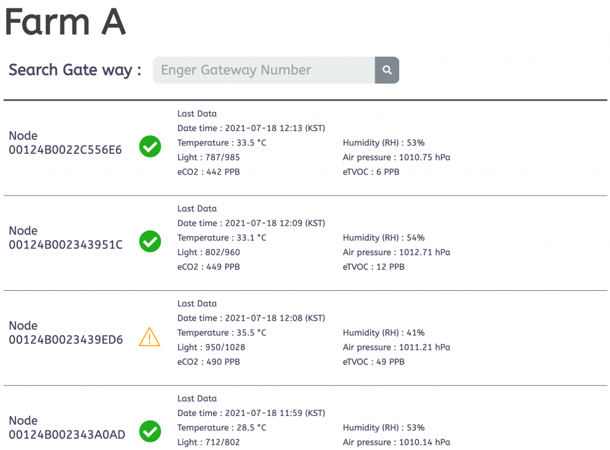

# Bluetooth Smart Agriculture

-------------------------

 
 

<table>
<tr align="center">
  <td> TOP </td>
</tr>
  <tr align="center">
    <td></td>
  </tr>
</table>

<table>
<tr align="center">
  <td> BOTTOM </td>
</tr>
  <tr align="center">
    <td></td>
  </tr>
</table>

-----------------------

Bluetooth Smart Agriculture 은 AxDen 의 Aggregator Platform 를 이용하여 온도, 기압, 조도 와 같은 Smart Agriculture 에서 필요한 핵심적인 센서 정보를 수집합니다.
 
Android, iOS, Aggregator 와 통신이 동시에 필요한 다양한 서비스 시나리오를 빠르게 테스트 할 수 있도록 제공하는 예제입니다.
 
 
Bluetooth smart farming uses AxDen's aggregator platform, and collects temperature, barometric pressure, and key sensor information required for smart farming.
 
This is an example that provides quick testing of various service scenarios that require communication with Android, iOS, and Aggregator at the same time.
 

-------------------------

### Bluetooth Smart Agriculture 의 주요 특징 및 기능
 

MCU | 설명
:-------------------------:|:-------------------------:
NRF52832 | BLE 5.0 / 5.1 / 5.2 / 5.3

센서 | 설명
:-------------------------:|:-------------------------:
BME280 | Air pressure, temperature sensor
HDC1080 | Humidity, temperature sensor
VCNL4040 | ToF distance, ambient light sensor
Soil moisture sensor | On board

Bluetooth Smart Agriculture 예제는 온도, 기압, 조도 와 같은 Smart Agriculture 에서 필요한 핵심적인 센서 정보를 수집하고 Bluetooth 를 이용하여 Android, iOS, Aggregator 에 전송합니다.
 
 
AxDen Aggregator Platform 과 연동하여 서버, DB 와 같은 인프라 구축 없이 Web 과 Mobile 에서 센서 정보를 확인합니다.
 
 
AxDen Aggregator Platform 에 저장된 센서 정보를 이용하여 Edge AI 를 학습시킵니다.
 

-------------------------

### Terminal & Android Application
 

terminal baudrate : 9600
 

<table>
  <tr align="center">
    <td> Terminal </td>
  </tr>
  <tr align="center">
    <td></td>
  </tr>
</table>

<table>
  <tr align="center">
    <td> </td>
    <td> Android </td>
    <td> </td>
  </tr>
  <tr align="center">
    <td></td>
    <td></td>
    <td></td>
  </tr>
</table>

-------------------------

#### AxDen Aggregator Platform 을 이용한 확인 방법
 

AxDen Aggregator 홈페이지에서 회원 가입 후 Bluetooth Smart Agriculture 의 MAC Address 를 등록합니다.
 

AxDen Aggregator 홈페이지에서 제공하는 COMPANY ID, DEVICE ID 를 Protocol.h 파일의 COMPANY_ID, DEVICE_ID 에 입력합니다.
 
 
`#define COMPANY_ID 0`
 
`#define DEVICE_TYPE 0`
 
 
컴파일 후 플래싱을 합니다.
 
 
터미널을 통해 COMPANY_ID, DEVICE_ID 가 정상적으로 적용되었는지 확인합니다.
 
 
아래 이미지와 같이 센서 정보를 Web 또는 Mobile 에서 확인할 수 있습니다.
 
 

 

-------------------------

### Note
 

Works with SoftDevice S132 v7.2.0, provided with SDK 17.1.0.
 

To compile it, clone the repository in the [SDK]/examples/ble_peripheral folder.

-------------------------

### [SDK Download](https://github.com/AxDen-Dev/NRF52_Ping_pong_example)

-------------------------

### [Project import](https://github.com/AxDen-Dev/NRF52_Ping_pong_example)

-------------------------

### [Eclipse setting](https://github.com/AxDen-Dev/NRF52_Ping_pong_example)
