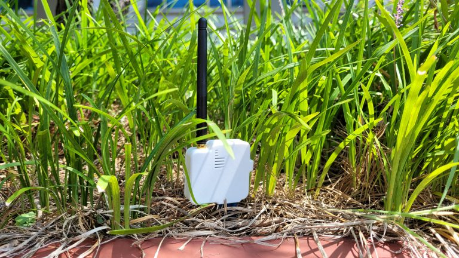
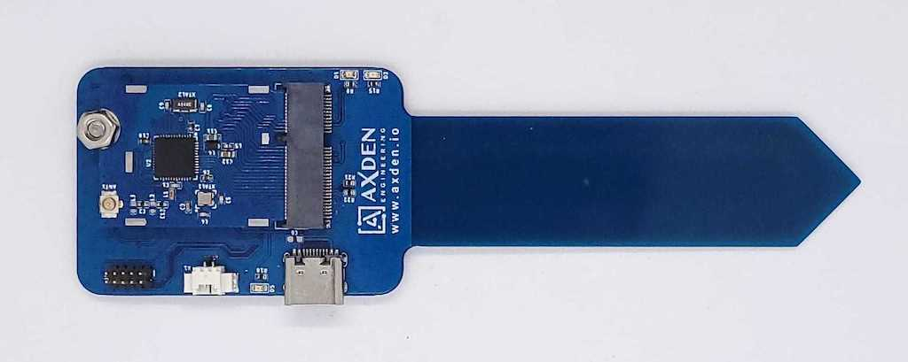
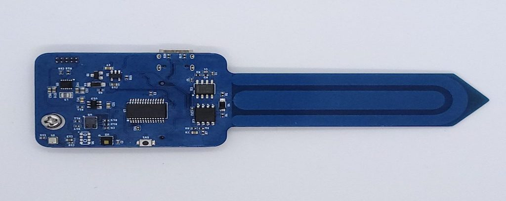
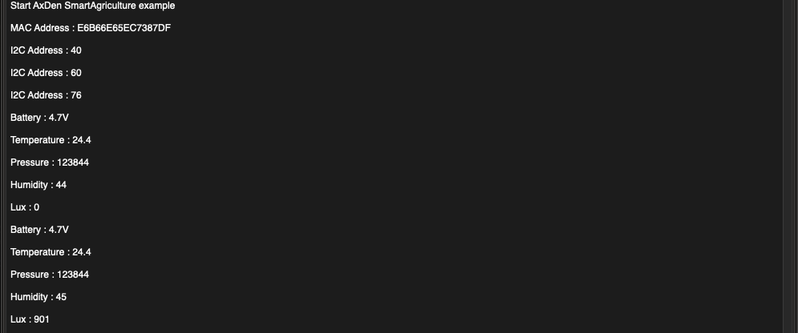
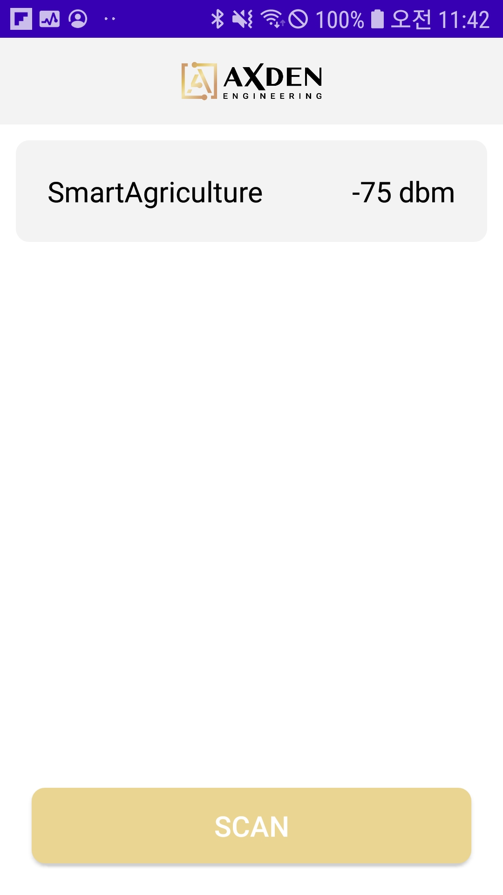
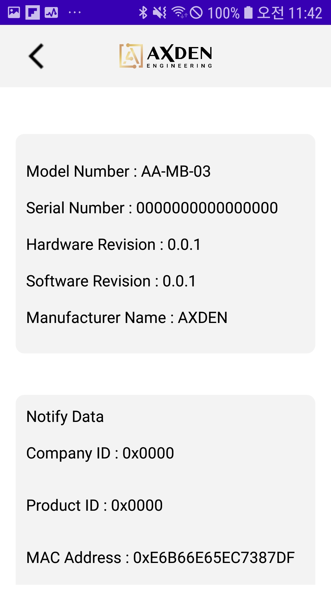
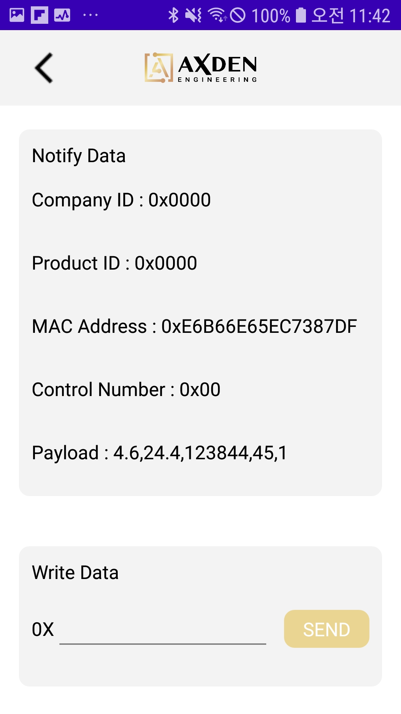

# Bluetooth Smart Agriculture

-------------------------

 
 

<table>
<tr align="center">
  <td> TOP </td>
</tr>
  <tr align="center">
    <td></td>
  </tr>
</table>

<table>
<tr align="center">
  <td> BOTTOM </td>
</tr>
  <tr align="center">
    <td></td>
  </tr>
</table>

-----------------------

Bluetooth smart farming uses AxDen's aggregator platform, and collects temperature, barometric pressure, and key sensor information required for smart farming.
 
This is an example that provides quick testing of various service scenarios that require communication with Android, iOS, and Aggregator at the same time.
 

----

Device can be purchased from the Naver Smart Store.
 

[Purchase Link : naver smart store](https://smartstore.naver.com/axden)
 
 

You can purchase it by contacting sales@axden.io

-------------------------

### Key feature and functions
 

MCU | Description
:-------------------------:|:-------------------------:
NRF52832 | BLE 5.0 / 5.1 / 5.2 / 5.3

Sensors | Description
:-------------------------:|:-------------------------:
BME280 | Air pressure, temperature sensor
HDC1080 | Humidity, temperature sensor
VCNL4040 | ToF distance, ambient light sensor
Soil moisture sensor | On board

The Bluetooth Smart Agricultural example collects key sensor information required by Smart Agriculture, such as temperature, air pressure, and illuminance, and sends it to Android, iOS, and Aggregators using Bluetooth.
 
 
Interwork with the AxDen Aggregator Platform to check sensor information on the Web and Mobile without building infrastructure such as servers and DBs.
 
 
Learn Edge AI using sensor information stored in the AxDen Aggregator Platform.
 

-------------------------

### Terminal & Android Application
 

terminal baudrate : 9600
 

[Donwload Android Application](https://play.google.com/store/apps/details?id=io.axden.module.example.axden_ble_module_example)
 

<table>
  <tr align="center">
    <td> Terminal </td>
  </tr>
  <tr align="center">
    <td></td>
  </tr>
</table>

<table>
  <tr align="center">
    <td> </td>
    <td> Android </td>
    <td> </td>
  </tr>
  <tr align="center">
    <td></td>
    <td></td>
    <td></td>
  </tr>
</table>

-------------------------

#### How to check using AXDEN Aggregator Platform
 

Enter COMPANY ID nad DEVCIE ID provided on the AXDEN Aggregator Platform website into COMPANY_ID and DEVCIE_ID in the Protocol.h header file.
 
 

[AXDEN Aggregator Platfrom](http://project.axden.io/)

 

`#define COMPANY_ID 0`

 

`#define DEVICE_TYPE 0`

 
Complie and flash.
 
 
Check whether COMPANY_ID and DEVICE_ID are applied correctly through the terminal
 
 
Sensor information can be found on the Web or Mobile
 

-------------------------

### Note
 

Works with SoftDevice S132 v7.2.0, provided with SDK 17.1.0.
 

To compile it, clone the repository in the [SDK]/examples/ble_peripheral folder.

-------------------------

### [SDK Download](https://github.com/AxDen-Dev/NRF52_Ping_pong_example)

-------------------------

### [Project import](https://github.com/AxDen-Dev/NRF52_Ping_pong_example)

-------------------------

### [Eclipse setting](https://github.com/AxDen-Dev/NRF52_Ping_pong_example)
